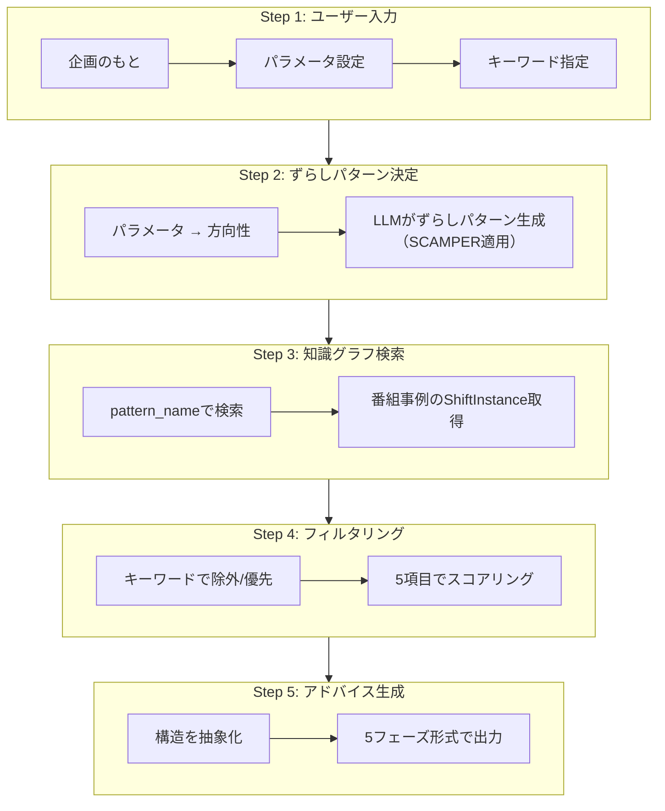
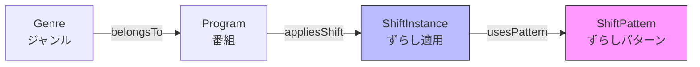

# GraphRAG（テレビ番組企画支援システム）

## 2. GraphRAG処理フロー



### 各Stepの役割

| Step | 主な処理 | 使用技術 | 目的 |
|:----:|---------|---------|------|
| 2 | ユーザー入力のパラメータ → ずらしパターン | SCAMPER + LLM | 構造的な方向性を決定 |
| 3 | 知識グラフ検索 | Neo4j_n10s | 検索空間を広げる |
| 4 | キーワードでフィルタリング（必要か？） | LLM | ユーザー意図で絞り込む |
| 5 | アドバイス生成 | LLM | 創造的提案を出力 |

---

## 2. ずらしパターン

### 設計方針

**ShiftPattern を 14種類の定義済みパターンとして固定化**

```
知識グラフ: 定義済み14パターンを保持
     ↓
Step 2: LLMは定義リストから選択
     ↓
Step 3: 選択されたpattern_nameで確実に検索
```

### 14種類のずらしパターン

| パターン名 | SCAMPERの要素 | 説明 | 例 |
|-----------|---------|------|-----|
| 対象の転換 | S | 焦点を別の要素に移動 | 料理→店主の人間性 |
| 役割の反転 | R | 主客を入れ替え | 大人→子どもが教える |
| 視点の移動 | S | 誰の視点かを変更 | 観光客→地元住民目線 |
| スケールの拡大 | M | 規模・時間を拡大 | 1日→1年密着 |
| スケールの縮小 | M | 規模・時間を縮小 | 全国→商店街 |
| 時間軸の変更 | R | 過去↔現在の入替 | 過去との対比 |
| 要素の移植 | P | 他ジャンルから転用 | バラエティ→情報番組 |
| 要素の組み合わせ | C | 異要素の掛け合わせ | グルメ×謎解き |
| 要素の削除 | E | 当たり前を削る | ナレーション削除 |
| 制約の追加 | A | 条件・ルールを付加 | 予算1000円縛り |
| 構造の再配置 | R | 順序・配置を変更 | 結果を先に見せる |
| 参加者の変更 | S | 出演者属性を変更 | プロ→素人 |
| 場所の転換 | S | 舞台設定を変更 | スタジオ→現場 |
| 目的の転換 | S | ゴールを変更 | 紹介→対決 |

#### SCAMPERの要素

| 要素 | 英語                        | おおまかな意味         | 発想のヒント（問いかけ例）                |
| -- | ------------------------- | -------------- | ---------------------------- |
| S  | Substitute                | 置き換える          | 何を別の素材・方法・人・仕組みに変えられるか？       |
| C  | Combine                   | 組み合わせる         | 2つ以上を合体したら新しい価値が出るか？          |
| A  | Adapt                     | 応用する／適応させる     | 他分野のやり方を持ち込めない？既存の解決策を転用できるか？ |
| M  | Modify / Magnify / Minify | 変更する／拡大する／縮小する | 形・色・流れ・UIを変えたら？大きく/小さくしたらどうなるか？   |
| P  | Put to other uses         | 別の用途に使う        | これ、違う場面やユーザーに使えないか？副次用途はあるか？     |
| E  | Eliminate                 | 取り除く           | いらない機能・手順・コストを削ると何が起きるか？      |
| R  | Reverse / Rearrange       | 逆転する／並べ替える     | 順序を逆にしたら？役割や前提をひっくり返したらどうなるか？     |

---

## 3. Step 2：パラメータからずらしパターンへ

### ユーザー入力パラメータ（5種類）

| パラメータ | 範囲 | 意味 |
|-----------|:----:|------|
| 冒険度 | 0-100 | 安全 ↔ 挑戦 |
| 独自性 | 0-100 | 王道 ↔ 独創的 |
| 実績重視 | 0-100 | 前例なしOK ↔ 実績重視 |
| ジャンル横断度 | 0-100 | 同ジャンル内 ↔ 異ジャンル融合 |
| ターゲット特化度 | 0-100 | 幅広く ↔ 特定層に刺さる |
| ずらし度 | 0-200 |  |


### 変換ロジック

```
変化スコア = (冒険度 + 独自性) / 2　　…　（仮の値）

  0-25  → 磨き上げ志向（既存の良さを磨く）
 25-45  → ひとひねり志向（王道にひとひねり）
 45-65  → 掛け合わせ志向（異要素を組み合わせ）
 65-85  → 逆転志向（常識を逆転）
 85-100 → 開拓志向（全く新しい領域）
```

### 方向性と推奨パターンの対応

| 方向性 | 推奨パターン |
|--------|-------------|
| 磨き上げ志向 | スケールの拡大/縮小、制約の追加 |
| ひとひねり志向 | 視点の移動、参加者の変更、場所の転換 |
| 掛け合わせ志向 | 要素の組み合わせ、要素の移植 |
| 逆転志向 | 役割の反転、対象の転換、目的の転換 |
| 開拓志向 | 要素の削除、構造の再配置、時間軸の変更 |

---

## 4. Step 3-4：知識グラフ検索とフィルタリング

### 知識グラフの構造



### 検索の流れ

```cypher
// Step 3: pattern_nameで検索
MATCH (sp:ShiftPattern {name: "役割の反転"})
      <-[:usesPattern]-(si:ShiftInstance)
      <-[:appliesShift]-(p:Program)
RETURN p.name, si.shiftFrom, si.shiftTo, si.shiftDegree
```

### Step 4 スコアリング（5項目）

| スコア項目 | 何を測るか |
|-----------|----------|
| キーワード関連度 | 重視キーワードとの関連性（LLM判定） |
| shift_degree適合度 | 冒険度・独自性との適合 |
| ジャンル優先度 | 同ジャンル/異ジャンル |
| ターゲット適合度 | 放送時間帯の類似性 |
| 実績スコア | 視聴率・放送年数 |

---

## 5. Step 5：アドバイス生成（5フェーズ構造）

### 出力フォーマット

```
━━━━━━━━━━━━━━━━━━━━━━━━━━━━━━━━━
【提案1】地元キッズガイド
━━━━━━━━━━━━━━━━━━━━━━━━━━━━━━━━━

▼ 創造的提案（150-200字）
  「役割の反転」を適用。地元の小学生が観光客をガイド...

▼ 実現可能性（100-150字）
  ・子役の確保: 地元小学校との連携
  ・安全管理: 保護者同伴で対応

▼ 市場分析（100-150字）
  類似番組との差別化ポイント...

▼ 社会的視点（80-120字）
  地域教育・郷土愛の醸成...

▼ 深掘り質問（50-80字）
  「子どもの成長」をシリーズ化できるか？
━━━━━━━━━━━━━━━━━━━━━━━━━━━━━━━━━
```

### 構造転用の流れ

```
成功事例: 「親が買い物する」→「子どもが買い物する」
              ↓ 抽象化
構造: 「通常の担い手」→「意外な担い手」
              ↓ ユーザー企画に適用
提案: 「大人がガイド」→「子どもがガイド」
```

---

## 6. 動作例

### 入力例

```
企画のもと: 「名古屋の隠れた名所を探検する地域密着番組」

パラメータ:
  冒険度: 70 / 独自性: 60 / 実績重視: 50
  ジャンル横断度: 40 / ターゲット特化度: 60

重視: 「子ども参加」「謎解き」「地域活性化」
避ける: 「ランキング形式」「食べ歩きだけ」
ターゲット: 日曜10:00 / ファミリー層
```

### 処理の流れ

```
Step 2-1: 変化スコア = (70+60)/2 = 65 → 逆転志向
          推奨SCAMPER: R (Reverse), S (Substitute)

Step 2-2: LLMが生成
          - 役割の反転: 大人がガイド → 子どもがガイド
          - 視点の移動: 観光客目線 → 地元住民目線
          - 時間軸の変更: 現在 → 過去との対比

Step 3: 「役割の反転」で検索 → 「はじめてのおつかい」等がヒット

Step 4: 「子ども参加」キーワードで優先度UP
        「ランキング形式」に該当する番組を除外

Step 5: 3パターンの創造的提案を生成
```

### 出力例

```
━━━━━━━━━━━━━━━━━━━━━━━━━━━━━━━━━
【提案1】地元キッズガイド
━━━━━━━━━━━━━━━━━━━━━━━━━━━━━━━━━

▼ 創造的提案（150-200字）
  「役割の反転」を適用。地元の小学生が観光客をガイド...

▼ 実現可能性（100-150字）
  ・子役の確保: 地元小学校との連携
  ・安全管理: 保護者同伴で対応

▼ 市場分析（100-150字）
  類似番組との差別化ポイント...

▼ 社会的視点（80-120字）
  地域教育・郷土愛の醸成...

▼ 深掘り質問（50-80字）
  「子どもの成長」をシリーズ化できるか？
━━━━━━━━━━━━━━━━━━━━━━━━━━━━━━━━━
```
