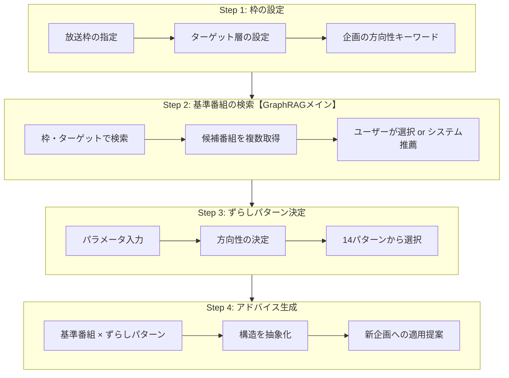
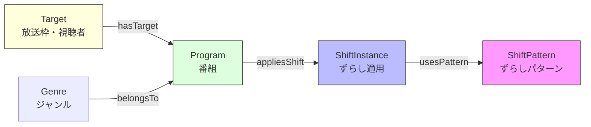

# GraphRAG（テレビ番組企画支援システム）

**更新日**: 2024年12月9日  
**前回からの主な変更点**: 教授との議論を踏まえ、GraphRAGの主用途と処理順序を根本的に見直し

---

## 1. 設計思想の修正

### 1.1 GraphRAGの主な用途（重要）

> **教授からの指摘**:  
> 「グラフラグを使うメインの用途って、このずらす前の番組を取ってくるところがグラフラグのメインの用途だと思ってたんですけれども」

**修正前（誤った理解）**:
```
GraphRAGの用途 = ずらしパターンで番組事例を検索する
```

**修正後（正しい理解）**:
```
GraphRAGの用途 = ずらす前の「元となる番組」を検索する
```

### 1.2 処理順序の修正

| 順序 | 修正前 | 修正後 |
|:---:|--------|--------|
| 1 | パラメータ入力 | **枠の設定**（放送枠・ターゲット） |
| 2 | ずらしパターン決定 | **基準番組の検索・選定** ← GraphRAGのメイン |
| 3 | 知識グラフ検索 | ずらしパターン決定 |
| 4 | フィルタリング | アドバイス生成 |
| 5 | アドバイス生成 | - |

---

## 2. 新しいGraphRAG処理フロー



### 各Stepの役割

| Step | 主な処理 | 使用技術 | 目的 |
|:----:|---------|---------|------|
| 1 | 枠・ターゲットの設定 | ユーザー入力 | 検索条件の確定 |
| 2 | **基準番組の検索** | **Neo4j + GraphRAG** | **ずらす前の番組を取得** |
| 3 | ずらしパターン決定 | SCAMPER + LLM | 変化の方向性を決定 |
| 4 | アドバイス生成 | LLM | 創造的提案を出力 |

---

## 3. Step 2: 基準番組の検索（GraphRAGのメイン機能）

### 3.1 検索の考え方

**基準番組とは**: ずらしを適用する前の「元となる番組」

```
ユーザーの企画意図
      ↓
  GraphRAGで検索
      ↓
  基準番組の候補（複数）を提示
      ↓
  ユーザーが選択 or システム推薦
      ↓
  選択された番組にずらしを適用
```

### 3.2 検索パターン

| パターン | 説明 | 対応 |
|---------|------|------|
| ユーザー指定 | 心当たりのある番組がある | 番組名で直接検索 |
| システム推薦 | 心当たりがない | 枠・ターゲットから候補を提示 |

### 3.3 複数候補の提示（重要）

> **教授からの指摘**:  
> 「元になる番組一個だけ決めてじゃなくてですね、これ複数候補を提示して、複数ユーザーが選べるようにした方がいいです」

**出力イメージ**:
```
━━━━━━━━━━━━━━━━━━━━━━━━━━━━━━━━━
【基準番組の候補】日曜10:00 / ファミリー層
━━━━━━━━━━━━━━━━━━━━━━━━━━━━━━━━━

[1] はじめてのおつかい
    - ジャンル: バラエティ / 密着型
    - 特徴: 子どもの成長、ハラハラ感
    - 適合度: ★★★★☆

[2] 出川哲朗の充電させてもらえませんか？
    - ジャンル: 旅バラエティ
    - 特徴: 地域密着、人情
    - 適合度: ★★★☆☆

[3] ブラタモリ
    - ジャンル: 教養 / 探索型
    - 特徴: 地域の歴史、発見
    - 適合度: ★★★☆☆

→ どの番組を基準にしますか？（番号で選択）
━━━━━━━━━━━━━━━━━━━━━━━━━━━━━━━━━
```

### 3.4 検索クエリ例

```cypher
// 枠・ターゲットに適合する番組を検索
MATCH (p:Program)-[:hasTarget]->(t:Target)
WHERE t.timeslot = "日曜10:00"
  AND t.audience = "ファミリー層"
RETURN p.name, p.genre, p.description
ORDER BY p.rating DESC
LIMIT 5
```

---

## 4. Step 3: ずらしパターン決定

### 4.1 14種類のずらしパターン

| パターン名 | SCAMPERの要素 | 説明 | 例 |
|-----------|:-------------:|------|-----|
| 対象の転換 | S | 焦点を別の要素に移動 | 料理→店主の人間性 |
| 役割の反転 | R | 主客を入れ替え | 大人→子どもが教える |
| 視点の移動 | S | 誰の視点かを変更 | 観光客→地元住民目線 |
| スケールの拡大 | M | 規模・時間を拡大 | 1日→1年密着 |
| スケールの縮小 | M | 規模・時間を縮小 | 全国→商店街 |
| 時間軸の変更 | R | 過去↔現在の入替 | 過去との対比 |
| 要素の移植 | P | 他ジャンルから転用 | バラエティ→情報番組 |
| 要素の組み合わせ | C | 異要素の掛け合わせ | グルメ×謎解き |
| 要素の削除 | E | 当たり前を削る | ナレーション削除 |
| 制約の追加 | A | 条件・ルールを付加 | 予算1000円縛り |
| 構造の再配置 | R | 順序・配置を変更 | 結果を先に見せる |
| 参加者の変更 | S | 出演者属性を変更 | プロ→素人 |
| 場所の転換 | S | 舞台設定を変更 | スタジオ→現場 |
| 目的の転換 | S | ゴールを変更 | 紹介→対決 |

### 4.2 ユーザー入力パラメータ

| パラメータ | 範囲 | 意味 |
|-----------|:----:|------|
| 冒険度 | 0-100 | 安全 ↔ 挑戦 |
| 独自性 | 0-100 | 定番 ↔ 独創的 |
| 実績重視 | 0-100 | 前例なしOK ↔ 実績重視 |
| ジャンル横断度 | 0-100 | 同ジャンル内 ↔ 異ジャンル融合 |
| ターゲット特化度 | 0-100 | 幅広く ↔ 特定層に刺さる |

> **検討事項**: ずらし度（0-200）は冒険度・独自性と重複する可能性あり。外すか、複合指標として再定義するか要検討。

### 4.3 パラメータから方向性への変換

```
変化スコア = (冒険度 + 独自性) / 2

  0-25  → 磨き上げ志向（既存の良さを磨く）
 25-45  → ひとひねり志向（王道にひとひねり）
 45-65  → 掛け合わせ志向（異要素を組み合わせ）
 65-85  → 逆転志向（常識を逆転）
 85-100 → 開拓志向（全く新しい領域）
```

### 4.4 方向性と推奨パターンの対応

| 方向性 | 推奨パターン |
|--------|-------------|
| 磨き上げ志向 | スケールの拡大/縮小、制約の追加 |
| ひとひねり志向 | 視点の移動、参加者の変更、場所の転換 |
| 掛け合わせ志向 | 要素の組み合わせ、要素の移植 |
| 逆転志向 | 役割の反転、対象の転換、目的の転換 |
| 開拓志向 | 要素の削除、構造の再配置、時間軸の変更 |

---

## 5. Step 4: アドバイス生成

### 5.1 成功パターンの応用 〜内容ではなく「型」だけを借りる〜

**ポイント**: 過去の成功番組から「内容」ではなく「型」だけを抽出し、新企画に当てはめる

```
① 成功番組から「型」を抽出

   「はじめてのおつかい」
     → 内容: 子どもが買い物をする
     → 型:  「普通はAがやること」を「意外なBがやる」

② 抽出した「型」を新企画に当てはめる

   型:  「普通はAがやること」を「意外なBがやる」
          ↓
   新企画: 「普通は大人がガイド」を「子どもがガイド」
```

> **なぜ「焼き直し」にならないか？**  
> 内容（買い物）ではなく、型（役割の反転）だけを借りるため、
> 全く異なるジャンル・テーマでも応用できる

### 5.2 出力フォーマット（5フェーズ構造）

```
━━━━━━━━━━━━━━━━━━━━━━━━━━━━━━━━━
【提案1】地元キッズガイド
基準番組: はじめてのおつかい
適用パターン: 役割の反転
━━━━━━━━━━━━━━━━━━━━━━━━━━━━━━━━━

▼ 創造的提案（150-200字）
  「役割の反転」を適用。地元の小学生が観光客をガイド...

▼ 実現可能性（100-150字）
  ・子役の確保: 地元小学校との連携
  ・安全管理: 保護者同伴で対応

▼ 市場分析（100-150字）
  類似番組との差別化ポイント...

▼ 社会的視点（80-120字）
  地域教育・郷土愛の醸成...

▼ 深掘り質問（50-80字）
  「子どもの成長」をシリーズ化できるか？
━━━━━━━━━━━━━━━━━━━━━━━━━━━━━━━━━
```

---

## 6. 動作例（修正版）

### 入力例

```
【Step 1: 枠の設定】
放送枠: 日曜10:00
ターゲット: ファミリー層
企画の方向性: 「名古屋の隠れた名所を探検する地域密着番組」
重視キーワード: 「子ども参加」「謎解き」「地域活性化」
避けるキーワード: 「ランキング形式」「食べ歩きだけ」
```

### 処理の流れ

```
【Step 2: 基準番組の検索】
  GraphRAGで検索 → 候補3件を提示
    [1] はじめてのおつかい（適合度: 高）
    [2] 出川哲朗の充電させてもらえませんか？
    [3] ブラタモリ
  
  → ユーザーが [1] を選択

【Step 3: ずらしパターン決定】
  パラメータ入力:
    冒険度: 70 / 独自性: 60
  
  変化スコア = 65 → 逆転志向
  
  推奨パターン:
    - 役割の反転
    - 対象の転換
    - 目的の転換

【Step 4: アドバイス生成】
  基準番組「はじめてのおつかい」× 役割の反転
    ↓
  「子どもが買い物」→「子どもがガイド」に転用
    ↓
  提案: 地元キッズガイド
```

---

## 7. 知識グラフの構造



---

## 8. 今後の課題

### 8.1 「王道 vs 意外性」問題

> **田口先生の指摘**: 王道だけを推薦すると「焼き直し」になる

**対応方針**:
1. まず現行設計（王道 + ずらし）で実装
2. 検証して不十分なら、基準番組にも意外性を持たせる推論を追加

### 8.2 ずらしパターンの統計分析（TODO）

手持ちのグラフDBで以下を集計:
- [ ] 各パターンの使用回数
- [ ] 「その他」カテゴリの割合（網羅性の確認）
- [ ] 使用頻度の低いパターンの考察

### 8.3 UI対応

- [ ] 複数候補から選択 → 深掘りのインタラクション
- [ ] 探索的な試行錯誤を支援するUI

---

## 補足: SCAMPERの要素

| 要素 | 英語 | おおまかな意味 | 発想のヒント |
|:---:|-----|--------------|-------------|
| S | Substitute | 置き換える | 何を別の素材・方法・人に変えられるか？ |
| C | Combine | 組み合わせる | 2つ以上を合体したら新しい価値が出るか？ |
| A | Adapt | 応用する | 他分野のやり方を持ち込めないか？ |
| M | Modify / Magnify / Minify | 変更する | 大きく/小さくしたらどうなるか？ |
| P | Put to other uses | 別の用途に使う | 違う場面やユーザーに使えないか？ |
| E | Eliminate | 取り除く | いらない機能・手順を削ると何が起きるか？ |
| R | Reverse / Rearrange | 逆転する | 順序を逆にしたら？役割をひっくり返したら？ |
